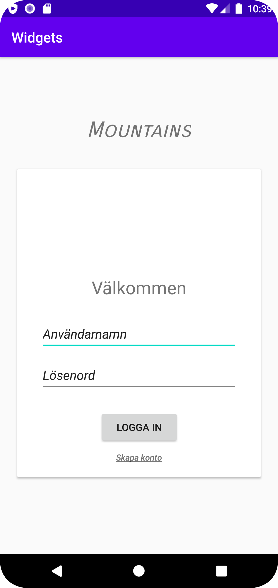

# Rapport

I denna uppgift skapade jag en stor constraint layout med en card view. Innanför card viewen placerade jag flera nestade constraint layouts som innehåller andra widgets för att skapa en login-sida.

Nedan visas innehållet av "card header". Det är en image view och en text view:
```
<ImageView
    android:id="@+id/profile_image"
    android:layout_width="120dp"
    android:layout_height="120dp"
    android:layout_marginTop="30dp"
    app:layout_constraintEnd_toEndOf="parent"
    app:layout_constraintStart_toStartOf="parent"
    app:layout_constraintTop_toTopOf="parent"
    android:background="@drawable/profile_picture" />

<TextView
    android:id="@+id/welcome_text"
    android:layout_width="wrap_content"
    android:layout_height="wrap_content"
    android:text="@string/welcome_message"
    android:textSize="25sp"
    app:layout_constraintEnd_toEndOf="parent"
    app:layout_constraintStart_toStartOf="parent"
    app:layout_constraintTop_toBottomOf="@id/profile_image" />
```

Nedan visas inputfälten:
```
<EditText
    android:id="@+id/username"
    android:layout_width="280dp"
    android:layout_height="48dp"
    android:ems="10"
    android:inputType="textPersonName"
    android:text="@string/username"
    app:layout_constraintEnd_toEndOf="parent"
    app:layout_constraintStart_toStartOf="parent"
    app:layout_constraintTop_toTopOf="parent" />

<EditText
    android:id="@+id/password"
    android:layout_width="280dp"
    android:layout_height="48dp"
    android:layout_marginTop="10dp"
    android:ems="10"
    android:inputType="textPersonName"
    android:text="@string/password"
    app:layout_constraintEnd_toEndOf="parent"
    app:layout_constraintStart_toStartOf="parent"
    app:layout_constraintTop_toBottomOf="@id/username" />
```

Längst ner i card viewen finns en knapp för att logga in samt en liten text view för att skapa ett konto.
```
<Button
    android:id="@+id/login_button"
    android:layout_width="wrap_content"
    android:layout_height="wrap_content"
    android:paddingLeft="25dp"
    android:paddingRight="25dp"
    android:text="@string/login"
    app:layout_constraintBottom_toBottomOf="parent"
    app:layout_constraintEnd_toEndOf="parent"
    app:layout_constraintHorizontal_bias="0.502"
    app:layout_constraintStart_toStartOf="parent"
    app:layout_constraintTop_toTopOf="parent"
    app:layout_constraintVertical_bias="0.347" />

<TextView
    android:id="@+id/create_account"
    android:layout_width="wrap_content"
    android:layout_height="wrap_content"
    android:text="@string/create_account"
    app:layout_constraintTop_toBottomOf="@id/login_button"
    app:layout_constraintStart_toStartOf="parent"
    app:layout_constraintEnd_toEndOf="parent"
    app:layout_constraintBottom_toBottomOf="parent"
    android:layout_marginTop="10dp"
    android:layout_marginBottom="20dp"
    android:fontFamily="sans-serif-medium"
    android:textStyle="italic"
    android:textSize="12sp" />
```
